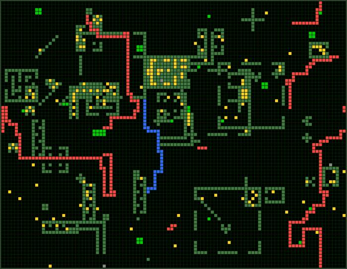
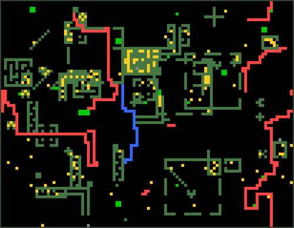
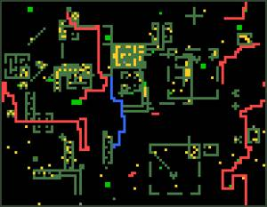
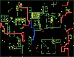

# Snake-Backend

Snake-Backend performs background operations for the [Snake-Server](https://github.com/ivan1993spb/snake-server).

## Start

1. Environment variables:
    ```
    SNAKE_API_ADDRESS=https://snakeonline.xyz/api
    LOG_LEVEL=DEBUG
    BROKER_REDIS_URL=redis://localhost:6379/0
    RESULT_REDIS_URL=redis://localhost:6379/1
    RATE_LIMITS_REDIS_URL=redis://localhost:6379/2
    ```
    For Prometheus:
    ```
    # Defaults:
    dramatiq_prom_host=0.0.0.0
    dramatiq_prom_port=9191

    # The path to store the prometheus database files.
    # Might be required to mount a volume if using Docker.
    dramatiq_prom_db=/path/to/prom/db
    ```
2. Start Redis:
    ```bash
    docker run --name redis --rm -d -p 6379:6379 redis
    ```
3. Start workers. It also starts the dramatiq prometheus exporter.
    ```bash
    dramatiq lib.actors
    ```
4. Start a scheduler:
    ```bash
    python scheduler.py
    ```

## Game screenshots

Big:



Medium:



Small:



Tiny:



[More screenshot examples here](examples)

## TODOs

- Interract with the server API via CLI interface
- Manage games
  * Manage bots
  * Create and delete games by schedule
  * Export and import map proportions

## License

See [LICENSE](LICENSE)
