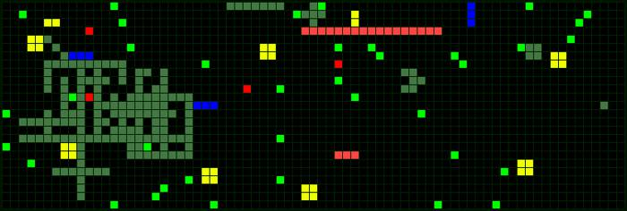

# Snake-Backend

*In process of development*

The Snake-Backend does backend operations with the Snake-Server.

See the Snake-Server source code here: https://github.com/ivan1993spb/snake-server

Try out the game: http://snakeonline.xyz/

## How to start

1. Setup environment:
    ```bash
    echo "SNAKE_API_ADDRESS=http://snakeonline.xyz/api" > .env
    ```
2. Start a local redis instance:
    ```bash
    docker run --name redis --rm -d -p 6379:6379 redis:5.0-alpine
    ```
3. Start workers. You have to start at least one:
    ```bash
    dramatiq lib.actors
    ```
4. Start scheduler:
    ```bash
    python app.py
    ```

## Futures

- Work with server API via CLI interface
  * [ ] Show basic information about server
- Bots futures
  * [ ] Start a swarm of bots
  * [ ] Stream game replays
- Work with games
  * [ ] Create and delete games by schedule - game rotation
  * [ ] Mass game creation
  * [ ] Export and import map proportions
- Generating images of maps
  * [x] Demon - walk through games and generate images
    + [x] By schedule

## Game screenshot examples





## Requirements

- the Snake-Server >= v4.3.0

## License

See [LICENSE](LICENSE).
